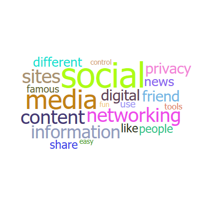

# PowerBI-visuals-WordCloud

> Word Cloud is a visual representation of word frequency and value. Use it to get instant insight into the most important terms in a set.

# Overview
Word Cloud is a visual representation of word frequency and value. Use it to get instant insight into the most important terms in your data.

With the interactive experience of Word Cloud in Power BI, you no longer have to tediously dig through large volumes of text to find out which terms are prominent or prevalent. You can simply visualize them as Word Cloud and get the big picture instantly and user Power BI’s interactivity to slice and dice further to uncover the themes behind the text content.

This visual also puts you in control on the appearance of the work cloud, be it the size or usage of space and how to treat the data. You can choose to break the words in the text to look for the frequency word or keep word break off to project a measure as a value of the text. You can also enable stop words to remove the common terms from the word cloud to avoid the clutter. By enabling rotation and playing with the angles allowed, you can become very creative with this visual.

Optionally you can also use a measure to provide weightage to the text. If none provided, it will simply use the frequency. Check out the formatting pane for more options.

See also [Word Cloud at Microsoft Office store](https://store.office.com/en-us/app.aspx?assetid=WA104380752&sourcecorrid=037b6fba-5738-4e90-a8ff-c4f1575a0b05&searchapppos=0&ui=en-US&rs=en-US&ad=US&appredirect=false)
